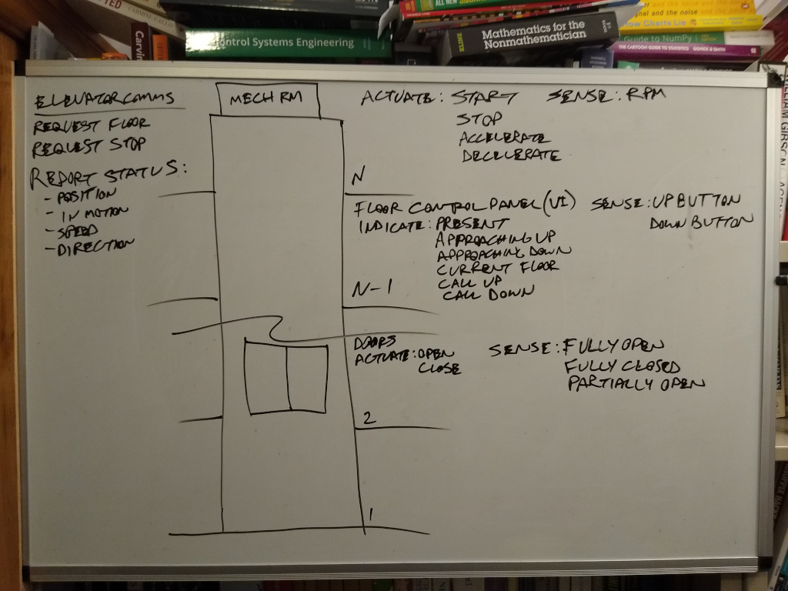
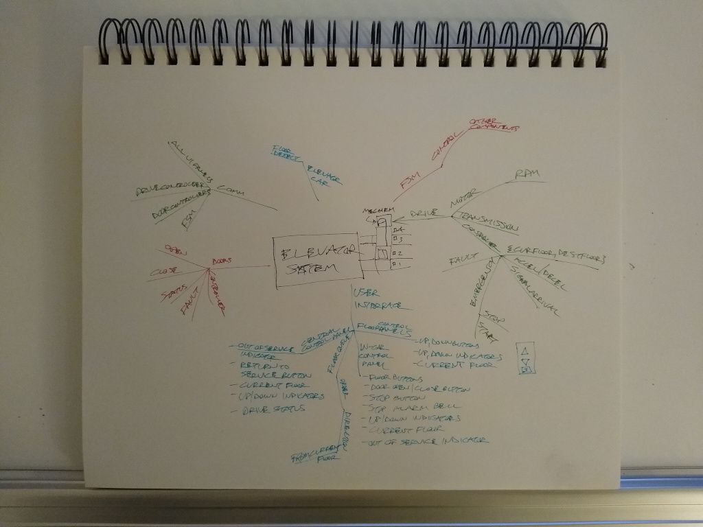
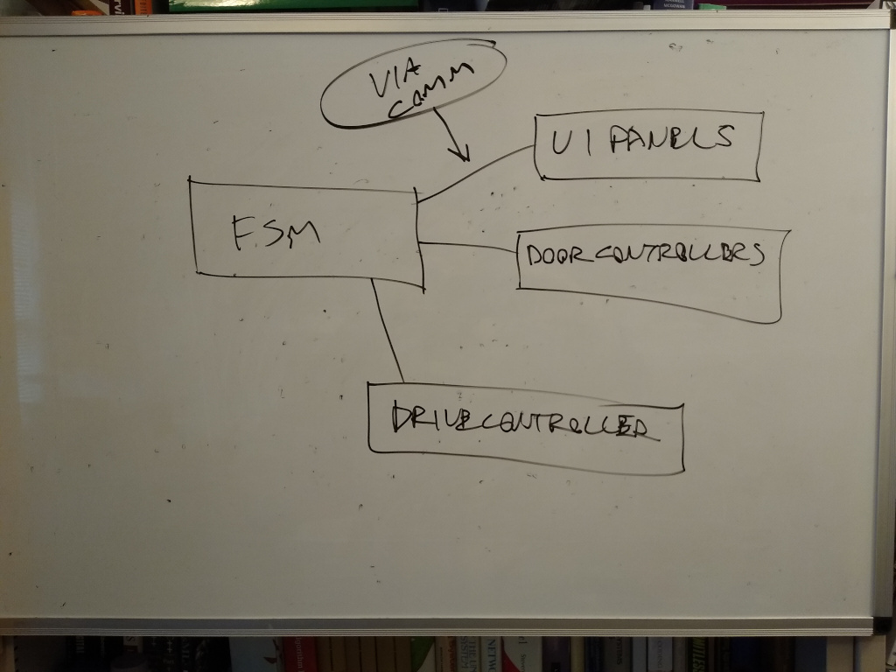
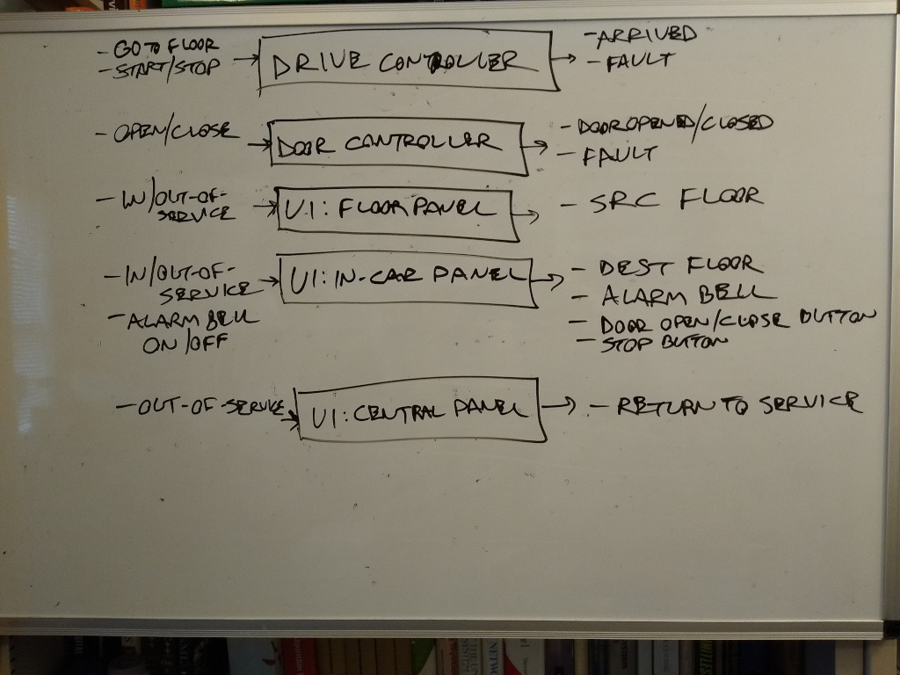
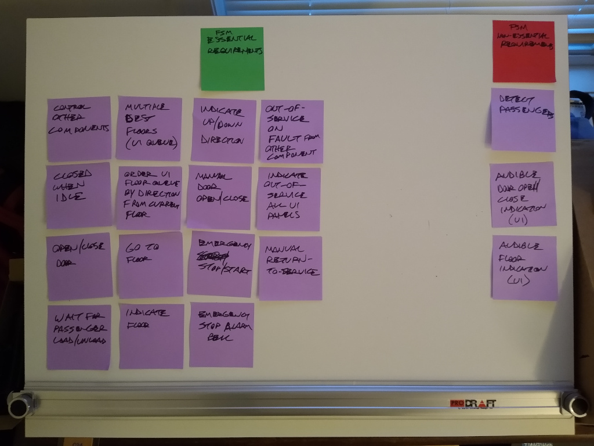
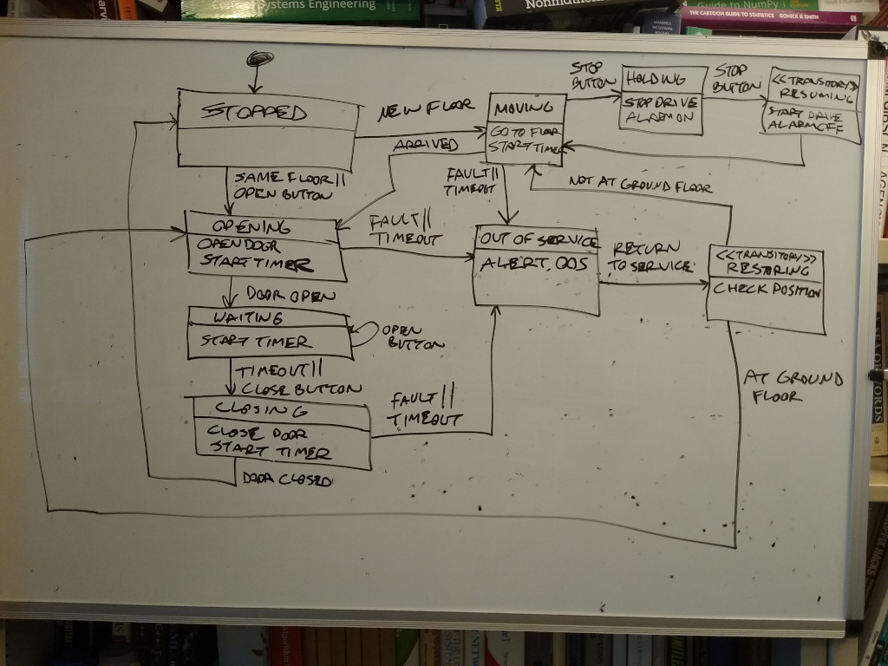
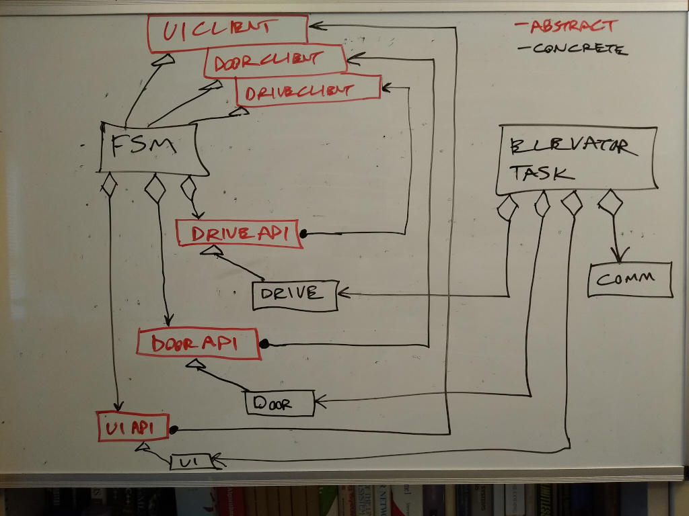
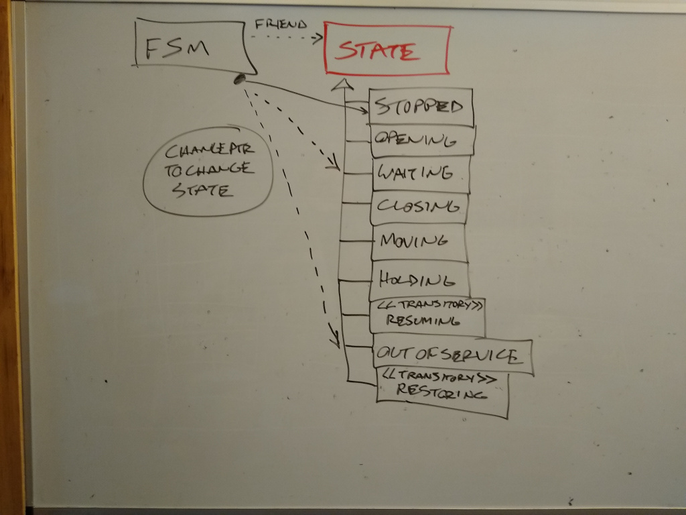
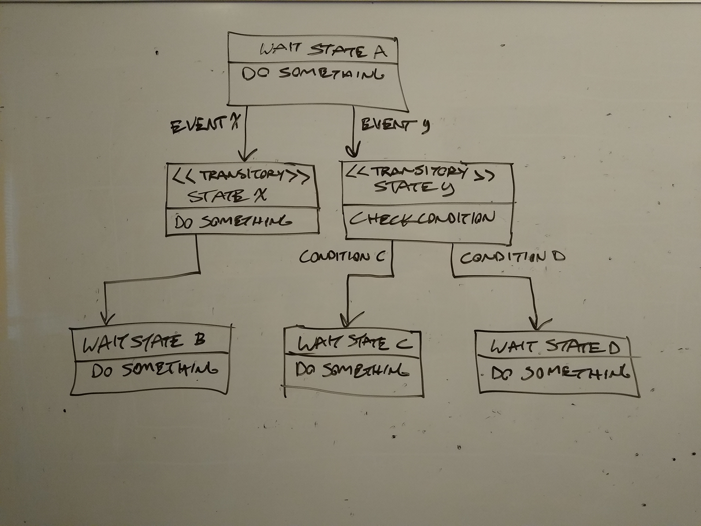

# Elevator FSM Example

> An example embedded system FSM using the State pattern and xUML semantics, unit-testable via Google Test.
>
> Author: Steve Branam (sdbranam@gmail.com) Dec 16, 2021.

# Prerequisites

Requires the following to be pre-installed (tested on Ubuntu 20.04):
- CMake 2.6 or later.
- Google Test

## Installing Google Test

Google Test has changed over time, and now incorporates Google Mock directly. This has resulted in a variety of different installation instructions available online, some of which no longer work when using Google Mock.

The basic test file and CMakeLists.txt for the tests here are based on [Getting started with Google Test (GTest) on Ubuntu](https://www.eriksmistad.no/getting-started-with-google-test-on-ubuntu/), but its Google Test installation procedure is no longer valid.

The installation procedure used to test this repo builds directly from the Google Test repo and is shown below. It was copied from the [googletest/README.md "Standalone CMake Project" section](https://github.com/google/googletest/blob/main/googletest/README.md#standalone-cmake-project). That README is identified as "More information about building GoogleTest" in the [Google Test repo "Getting Started" section](https://github.com/google/googletest).

```
git clone https://github.com/google/googletest.git -b release-1.11.0
cd googletest
mkdir build
cd build
cmake ..

make
sudo make install
```

As a minor improvement, it should be possible to eliminate the *main()* function in the test program and link with a gtest_main or gmock_main library, but attempts to do that so far with this installation have been unsuccessful, resulting in link errors.

# Build


To build in the repo:
```
cmake CMakeLists.txt
make
```

# Test

To run the built test executable:
```
./runTests
```

To run the executable under GDB for debugging (for instance, if you make changes and a test fails unexpectedly, or the program crashes):
```
gdb runTests
```

Example run:
```
sbranam@sbranam-HP-Laptop-14-dq0xxx:~/repos/elevator-fsm$ ./runTests 
[==========] Running 19 tests from 4 test suites.
[----------] Global test environment set-up.
[----------] 7 tests from Given_StoppedElevator
[ RUN      ] Given_StoppedElevator.Should_BeIdle_When_NoActivity
[       OK ] Given_StoppedElevator.Should_BeIdle_When_NoActivity (1 ms)
[ RUN      ] Given_StoppedElevator.Should_NotBeIdle_When_SameFloorRequested
[       OK ] Given_StoppedElevator.Should_NotBeIdle_When_SameFloorRequested (0 ms)
[ RUN      ] Given_StoppedElevator.Should_OpenDoor_When_SameFloorRequested
[       OK ] Given_StoppedElevator.Should_OpenDoor_When_SameFloorRequested (1 ms)
[ RUN      ] Given_StoppedElevator.Should_OpenDoor_When_OpenButtonPushed
[       OK ] Given_StoppedElevator.Should_OpenDoor_When_OpenButtonPushed (0 ms)
[ RUN      ] Given_StoppedElevator.Should_MoveToFloor_When_NewFloorRequested
[       OK ] Given_StoppedElevator.Should_MoveToFloor_When_NewFloorRequested (0 ms)
[ RUN      ] Given_StoppedElevator.Should_GoOutOfService_When_SameFloorRequestedAndDoorTimesOut
[       OK ] Given_StoppedElevator.Should_GoOutOfService_When_SameFloorRequestedAndDoorTimesOut (0 ms)
[ RUN      ] Given_StoppedElevator.Should_GoOutOfService_When_SameFloorRequestedAndDoorFaults
[       OK ] Given_StoppedElevator.Should_GoOutOfService_When_SameFloorRequestedAndDoorFaults (0 ms)
[----------] 7 tests from Given_StoppedElevator (4 ms total)

[----------] 5 tests from Given_MovingElevator
[ RUN      ] Given_MovingElevator.Should_BeWaiting_When_Arrived
[       OK ] Given_MovingElevator.Should_BeWaiting_When_Arrived (0 ms)
[ RUN      ] Given_MovingElevator.Should_Stop_When_StopButtonPushed
[       OK ] Given_MovingElevator.Should_Stop_When_StopButtonPushed (0 ms)
[ RUN      ] Given_MovingElevator.Should_Resume_When_StopButtonPushedTwice
[       OK ] Given_MovingElevator.Should_Resume_When_StopButtonPushedTwice (0 ms)
[ RUN      ] Given_MovingElevator.Should_GoOutOfService_When_DriveTimesOut
[       OK ] Given_MovingElevator.Should_GoOutOfService_When_DriveTimesOut (0 ms)
[ RUN      ] Given_MovingElevator.Should_GoOutOfService_When_DriveFaults
[       OK ] Given_MovingElevator.Should_GoOutOfService_When_DriveFaults (0 ms)
[----------] 5 tests from Given_MovingElevator (3 ms total)

[----------] 4 tests from Given_WaitingElevator
[ RUN      ] Given_WaitingElevator.Should_KeepDoorOpen_When_OpenButtonPushed
[       OK ] Given_WaitingElevator.Should_KeepDoorOpen_When_OpenButtonPushed (0 ms)
[ RUN      ] Given_WaitingElevator.Should_CloseDoor_When_TimerExpires
[       OK ] Given_WaitingElevator.Should_CloseDoor_When_TimerExpires (0 ms)
[ RUN      ] Given_WaitingElevator.Should_CloseDoor_When_CloseButtonPushed
[       OK ] Given_WaitingElevator.Should_CloseDoor_When_CloseButtonPushed (0 ms)
[ RUN      ] Given_WaitingElevator.Should_BeIdle_When_DoorCloses
[       OK ] Given_WaitingElevator.Should_BeIdle_When_DoorCloses (0 ms)
[----------] 4 tests from Given_WaitingElevator (2 ms total)

[----------] 3 tests from Given_OutOfServiceElevator
[ RUN      ] Given_OutOfServiceElevator.Should_BeWaiting_When_ServiceRestoredAtGroundFloor
[       OK ] Given_OutOfServiceElevator.Should_BeWaiting_When_ServiceRestoredAtGroundFloor (0 ms)
[ RUN      ] Given_OutOfServiceElevator.Should_MoveToGround_When_ServiceRestoredOffGroundFloor
[       OK ] Given_OutOfServiceElevator.Should_MoveToGround_When_ServiceRestoredOffGroundFloor (0 ms)
[ RUN      ] Given_OutOfServiceElevator.Should_MoveToGround_When_ServiceRestoredAtOtherFloor
[       OK ] Given_OutOfServiceElevator.Should_MoveToGround_When_ServiceRestoredAtOtherFloor (1 ms)
[----------] 3 tests from Given_OutOfServiceElevator (2 ms total)

[----------] Global test environment tear-down
[==========] 19 tests from 4 test suites ran. (13 ms total)
[  PASSED  ] 19 tests.
```

# Requirements

An elevator has a well-defined set of user interfaces and behaviors. I created an initial diagram of a typical system:



I used two methods to brainstorm and identify requirements:
- Tony Buzan's mind maps. See [Mind Map Mastery: The Complete Guide to Learning and Using the Most Powerful Thinking Tool in the Universe](https://www.amazon.com/Mind-Map-Mastery-Complete-Learning/dp/1786781417/), by Tony Buzan.
- Mark Rober's requirements categorization into essential and non-essential sets. See [Creative Engineering](https://monthly.com/mark-rober-engineering), by Mark Rober.

I produced the following mind map:




That led to this simple component architecture:



- FSM: the main FSM coded here that coordinates activity among the other components.
- UI panels: the various user interface panels on the floors, in the elevator car, and in the elevator mechanical room.
- Door controllers: the various door controllers on each floor and in the elevator car.
- Drive controller: the elevator drive controller for the motor and transmission.
- Comm: communications tying together the UI panels and the controllers.

In order to keep the FSM as simple as possible, I assigned a degree of intelligent functionality to the other components:
- UI: the UI maintains a queue of floor requests, ordered by floor number relative to the current floor and direction of travel, up or down. The FSM retrieves the next floor from the head of the queue. The UI is free to reorder the queue dynamically based on system activity, for instance to add a floor requested from someone standing at a floor control panel as the elevator passes it by.
- Door and drive: the controller accepts action initiation commands, then completes them independently and signals the FSM on completion or fault. In particular, the drive controller can be commanded to go to a floor, and based on the current floor, runs the drive motor and transmission through a suitable acceleration/deceleration profile that provides a smooth, comfortable ride for the passengers.
- Comm: this handles status reporting between the UI and other components, for instance to indicate floors as the drive controller detects the elevator car has reached or passed them.

This separation of concerns avoids adding significant complexity to the FSM and keeps it focused on primary control. It means that the other components are themselves active control systems, not merely passive components. This resulted in the following sets of input control actions and output event signals:



I settled on the following requirements (the final code has some differences from the photos captured here; one thing I would do differently is more explicitly separate UI requirements from FSM requriments):



Based on these, I produced the following state machine diagram:



# Design

The code is a direct implementation of the state machine diagram. I developed it using TDD, starting from an up-front design pattern. See [Does TDD Really Lead to Good Design?](https://www.youtube.com/watch?v=KyFVA4Spcgg), by Sandro Mancuso, for an excellent discussion of emergent vs up-front initial design with TDD; I used both approaches here.

The classes are structured to allow TDD-based implementation and off-target unit-testability, while being deployable on a target embedded system.
Classes are split into target-specific and target-agnostic functionality.

Target-specific classes have full knowledge of the target embedded system elements, incorporating hardware-specific and RTOS-specific details.
They can only run on the target system.

Target-agnostic classes only know about abstract interfaces to system elements. They can run both on the target system and off-target.
Target-specific classes should only contain simple logic, since they are not unit-testable. The bulk of complexity should be delegated to target-agnostic
classes, where it can be unit-tested off-target.

The main class that would use this FSM on a target embedded system would be target-specific; it would know all the concrete composable parts that are needed on the target, and construct them to assemble the functional RTOS task. It would handle all specific RTOS interaction.

The classes with target-specific hardware and RTOS dependencies are split into target-agnostic abstract API and
client interfaces, and target-specific concrete implementations; that allows the implementations to be mocked in Google Test. That then allows the FSM
class to be target-agnostic and fully unit-testable, relying on the abstract interfaces for event input and control actions in either the target or off-target
environments.

For a given system component that the FSM interacts with, there are 3 classes:
- The component API abstract base class. This provides the control actions that the FSM may perform on the component.
- The component concrete class. This implements the control actions on the actual hardware or RTOS components. Not included in this example.
- The component client abstract base class. This provides the event callback interface to signal events to the FSM (with event parameters).

This results in the following classes:



(I forgot to show an additional timer component that follows this pattern, with Timer Client and Timer API classes)

 The Elevator Task and Comm classes are target-specific classes not included in this example:
 - Elevator Task implements the RTOS-specific task and interactions.
 - Comm provides communication between all the UI control panels and other components.

The FSM uses the State pattern as described in [Design Patterns: Elements of Reusable Object-Oriented Software](https://www.amazon.com/Design-Patterns-Elements-Reusable-Object-Oriented/dp/0201633612/), by Erich Gamma, Richard Helm,
Ralph Johnson, and John Vlissides,:
- Each FSM state is a subclass of the base State class.
- The State class defines the API for all possible events with virtual handler functions.
- Each state class implements the particular events it handles with its specific virtual functions. Unhandled events are ignored.
- All state objects are singletons, accessed via each class' static *instance()* function.
- The FSM class declares State (and all its subclasses) as a friend so that its member functions can access FSM class private members.
- The FSM has a polymorphic pointer to the current state object.
- State changes occur by changing the pointer in the FSM to a different State object.
- The FSM class implements the same set of events as the State class with an identical set of handler functions (non-virtual). When an event
occurs, the caller calls the appropriate FSM public event handler function. This handler stores any event parametes, then delegates to the State event handler through the current value of the state pointer, thereby handling the event polymorphically in the current state.



The FSM follows the rules of Executable UML (xUML), as described in [Executable UML: A Foundation for Model-Driven Architecture](https://www.amazon.com/Executable-UML-Foundation-Model-Driven-Architecture/dp/0201748045/), by Stephen Mello
and Marc Balcer, and [Models to Code: With No Mysterious Gaps](https://www.amazon.com/Models-Code-No-Mysterious-Gaps/dp/1484222164/), by Leon Starr, Andrew Mangogna, and Stephen Mellor:
- The FSM is a Moore machine, so actions are associated with states, not transitions.
- Each state has only one action routine, performed on entry (including transition-to-self). This is virtual function *enter()*.
- When changing state, after changing the state pointer, the FSM calls the new state's entry function automatically.

The xUML definition allows for two types of states:
- *Wait states*, where the FSM waits for some event to trigger state transition after performing its entry function.
- *Transitory states*, where the FSM immediately transitions to another state after performing its entry function.
  - One common use for this is to make a decision about what state to go to next, so it's useful to further classify such transitory states as *decision states*: transitory states that have more than one exit transition.
  - Formally, a transitory state may be thought of as sending itself a completion event that triggers the transition. As a practical matter, this can be implemented by the entry function itself simply changing directly to the next state, avoiding the additional code and overhead of an explicit event.

The modeling notation doesn't distinguish these, but it's useful to use the keyword notation to highlight `<<transitory>>` states. That results in the following general state representations:



The test program mocks the component concrete classes with Google Mock and by mocking the client events. That allows the tests to drive the FSM through its behaviors, capturing mock activity and details reported via the FSM public API to verify the behaviors.

It is critical in tests to avoid examining the internals of the code under test, because that produces brittle tests (tests that fail when the implementation is changed, even if the implementation itself is correct). The tests here exercise the FSM stricly through its interfaces. They do need to be aware of the proper sequence of events to drive the FSM; these are all defined by the original state machine diagram.
